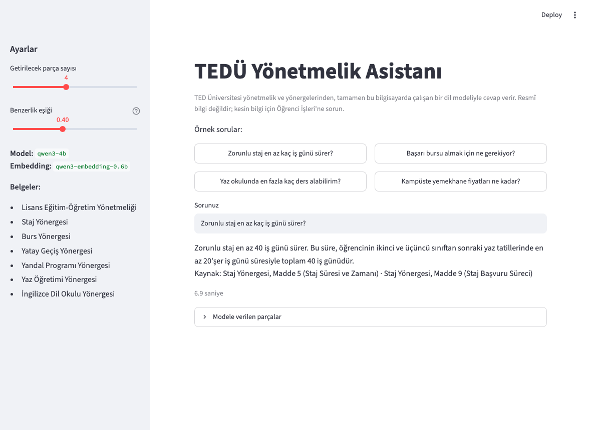
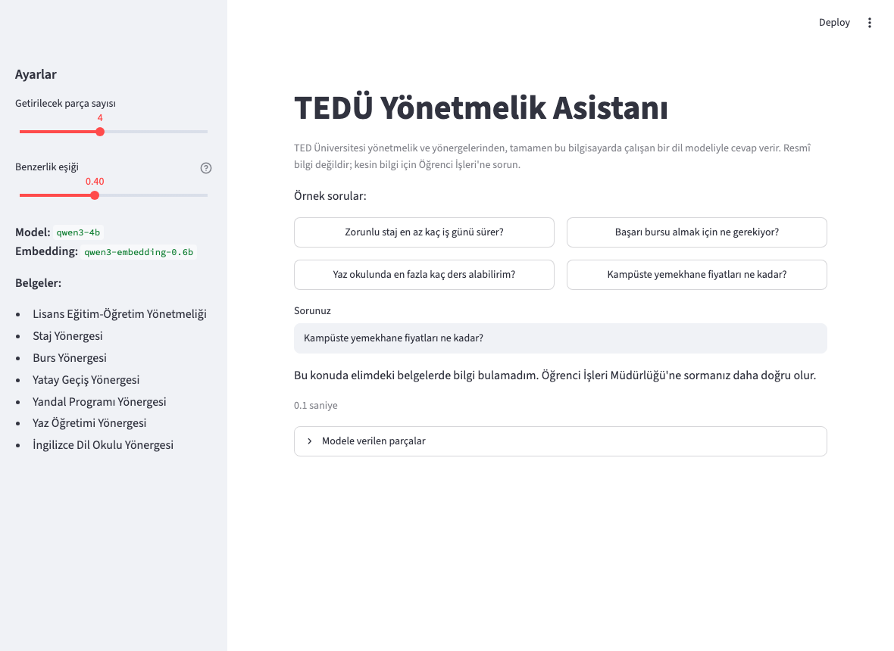

# TEDÜ Yönetmelik Asistanı

TED Üniversitesi'nin yönetmelik ve yönergelerine (staj, burs, yatay geçiş, yandal, yaz okulu,
İngilizce hazırlık...) Türkçe soru sorabildiğiniz, tamamen kendi bilgisayarınızda çalışan bir
soru-cevap asistanı. Cevapları [Microsoft Foundry Local](https://learn.microsoft.com/azure/foundry-local/)
üzerinde çalışan yerel bir dil modeli üretiyor, bilgiyi de RAG (retrieval-augmented generation)
yaklaşımıyla belgelerin içinden alıyor. İlk kurulumdaki model indirme dışında internet gerekmiyor.

Bu proje Microsoft Türkiye Yaz Okulu 2026 kapsamında, "Building Your First Local RAG Application
with Foundry Local" konusu için yapıldı. Ne yaptığımı ve ne öğrendiğimi anlattığım kısa video:
https://drive.google.com/file/d/1JOWI-GT7PYEPfU8ZCl0rfjmnjFi-yZ8m/view?usp=sharing



## Neden bu konu

Öğrenci işlerine sorulan soruların çoğunun cevabı aslında yönetmeliklerde yazıyor ama kimse
15 sayfalık yönetmeliği baştan sona okumuyor. "Staj kaç iş günü?", "Yaz okulunda kaç ders
alabilirim?", "Kaç dönem izin alabilirim?" gibi sorular her dönem tekrar soruluyor. Belgeler
herkese açık olduğu için gerçek verili, gerçek ihtiyaca yönelik küçük bir asistan yapmak
mantıklı geldi. Aynı yapı bir şirketin kendi dokümanları için de aynen çalışır.

## Nasıl çalışıyor

```
belgeler/*.txt  ─►  madde madde parçalama  ─►  embedding (qwen3-embedding-0.6b)  ─►  SQLite
                                                                                        │
soru  ─►  embedding  ─►  cosine benzerlik (numpy)  ─►  en yakın 4 parça  ─►  eşik kontrolü ◄─┘
                                                                              │
                                              cevap + kaynak  ◄─  qwen3-4b  ◄─┘
```

1. **İndeksleme** (`indeksle.py`): Yedi belge `MADDE 5 –` gibi başlıklardan bölünüyor, her
   parçanın başına belge adı ve madde numarası ekleniyor, embedding'i çıkarılıp SQLite'a
   yazılıyor. 164 parça, yaklaşık 20 saniye.
2. **Arama** (`asistan/arama.py`): Sorunun embedding'i tüm parçalarla karşılaştırılıyor, en
   yakın dört parça alınıyor. En iyi parça bile 0,40 benzerliğin altındaysa modele hiç
   sorulmuyor, "bu konuda belgelerde bilgi bulamadım" deniyor.
3. **Cevap** (`asistan/cevap.py`): Parçalar ve soru, "sadece bu parçalara dayan, uydurma"
   talimatıyla yerel modele gönderiliyor. Cevabın altına, cevapla en çok örtüşen parçaların
   belge adı ve madde numarası ekleniyor.

Foundry Local burada modelleri indiren, GPU'da çalıştıran ve OpenAI uyumlu bir HTTP API açan
katman. Uygulama `foundry server` servisine `openai` paketiyle bağlanıyor; modeller Mac'te
Metal (WebGPU) üzerinde, Windows'ta CUDA/NPU üzerinde çalışıyor.

## Kurulum ve çalıştırma

Foundry Local'ı kurun (Python 3.11+ gerekir):

```bash
# macOS (Apple Silicon)
brew tap microsoft/foundrylocal && brew install foundrylocal
# Windows
winget install Microsoft.FoundryLocal
```

Sonra:

```bash
git clone https://github.com/erenmuammer/tedu-yonetmelik-asistani.git
cd tedu-yonetmelik-asistani
python3 -m venv .venv && source .venv/bin/activate     # Windows: .venv\Scripts\activate
pip install -r requirements.txt

python indeksle.py                 # belgeleri parçalar ve embedding'leri SQLite'a yazar
python sor.py "Zorunlu staj en az kaç iş günü sürer?"
python sor.py                      # soru-cevap döngüsü
streamlit run arayuz.py            # web arayüzü
```

Modeller (embedding ~0,5 GB, qwen3-4b ~3 GB) ilk çalıştırmada otomatik iniyor; isterseniz
önceden `foundry model download qwen3-4b` ile indirebilirsiniz. Model adları, parça sayısı ve
eşik gibi ayarlar `asistan/ayarlar.py` içinde.

Testler için `python -m pytest`, tüm test sorularını yeniden çalıştırmak için
`python degerlendir.py` (sonuçları `docs/test_sonuclari.md` dosyasına yazar).

## Dosyalar

```
belgeler/            TEDÜ yönetmelik ve yönergeleri (pdftotext çıktısı) + KAYNAKLAR.md
asistan/
  ayarlar.py         model adları, top-k, eşik, dosya yolları
  parcalama.py       sayfa başlıklarını temizleme, madde bazlı bölme
  gomme.py           embedding çıkarma
  veritabani.py      SQLite (parçalar + float32 vektörler)
  arama.py           cosine benzerlik, eşik, eş anlamlı sözlüğü
  cevap.py           prompt, model çağrısı, cevap temizliği, kaynak satırı
  foundry.py         Foundry Local servisine bağlanma, model yükleme
indeksle.py          belgeler -> SQLite
sor.py               komut satırı arayüzü
arayuz.py            Streamlit arayüzü
degerlendir.py       test sorularını toplu çalıştırır
testler/             pytest (model gerektirmeyen parçalar için)
docs/                test sonuçları, model karşılaştırması, ekran görüntüleri, sunum
```

## Tasarım kararları

**Madde bazlı parçalama.** Yönetmelikte doğal birim madde; sabit uzunlukta kesmek maddeleri
ortasından bölerdi. O yüzden `MADDE n` başlıklarından bölüyorum. Sadece çok uzun maddeler (staj yönergesinde tek fıkrası 2600 karakter olan var) fıkra ve
cümle sınırlarından tekrar bölünüyor. Her parçanın başına "Staj Yönergesi, Madde 5 (Staj Süresi ve
Zamanı):" etiketini ekleyip öyle embedding çıkarıyorum; 16 soruluk retrieval testinde bu etiket
top-1 isabeti 9'dan 12'ye, top-4 isabeti 13'ten 15'e çıkardı.

**SQLite + numpy.** 164 parça için ayrı bir vektör veritabanına gerek yok. Vektörler float32
BLOB olarak SQLite'ta duruyor, aramada hepsi belleğe alınıp tek bir matris çarpımıyla
karşılaştırılıyor (embedding'ler normalize olduğu için nokta çarpım = cosine). Binlerce belge olsa
sqlite-vec ya da bir vektör veritabanı gerekirdi.

**Benzerlik eşiği 0,40.** Belgelerde cevabı olan sorularda en iyi parçanın benzerliği 0,43-0,67
arasında çıktı, alakasız sorularda ("hava nasıl", "Python'da liste nasıl sıralanır") 0,23-0,33.
İkisinin arasına 0,40 koydum. Eşiğin altında kalınca modele hiç gidilmiyor; küçük modeller alakasız
bağlamdan bile cevap uydurmaya meyilli olduğu için bu, prompt'a "bilmiyorsan bilmiyorum de"
yazmaktan daha güvenilir çıktı.

**Kaynak satırını model değil uygulama yazıyor.** Modelden "Kaynak: belge, madde" satırı
istediğimde ya prompt'taki örneği aynen kopyaladı ya da parçaların tamamını geri yazdı. Şimdi
cevaptaki kelimelerle en çok örtüşen iki parçanın etiketi cevabın altına ekleniyor; arayüzde
modele giden parçaların tamamı da görülebiliyor.

**SDK yerine HTTP.** pip'teki `foundry-local-sdk` 2.0.1 bu Mac'te WebGPU desteklemediği için
modelleri CPU'da çalıştırıyordu, üstelik CLI'nin indirdiği modelleri görmüyordu. `foundry server`
servisi ise GPU kullanıyor ve OpenAI uyumlu API açıyor; uygulama ona bağlanıyor. Detay
`asistan/foundry.py` başında.

**Model seçimi.** phi-4-mini, qwen3-1.7b ve qwen3-4b'yi aynı sorularla karşılaştırdım;
Türkçede düzgün cevap veren tek model qwen3-4b oldu. Qwen3'ün "düşünme" modu cevabı 15 saniyeye
çıkarıyordu, `/no_think` ile kapattım. Ayrıntılar: [docs/model_karsilastirma.md](docs/model_karsilastirma.md).

**Eş anlamlı sözlüğü.** Öğrenci "kayıt dondurma" diyor, yönetmelik "izin" diyor; embedding bu
ikisini eşleştiremedi. Birkaç kelimelik küçük bir sözlükle soruya yönetmelikteki karşılığı
ekleniyor (`asistan/arama.py`).

## Test sonuçları

19 soruluk bir setle test ettim: 11'i belgelerde cevabı olan, 1'i belgede farklı terimle geçen,
1'i belgede net olmayan, 4'ü belgelerde olmayan, 2'si uç durum (tek kelime, çok genel soru). Tam çıktı [docs/test_sonuclari.md](docs/test_sonuclari.md) dosyasında,
`degerlendir.py` ile üretildi.

- Belgede olmayan 4 soru, belgede net olmayan devam sorusu ve "yönetmelik ne diyor" gibi çok genel
  soru eşiğe takılıp modele gitmeden reddedildi; "staj" gibi tek kelimelik soruya ise kısa bir özet verildi.
- Belgede olan sorularda sayı ve koşullar genelde doğru aktarılıyor: staj 40 iş günü, yaz
  okulunda en fazla iki ders (mezuniyet durumunda üç), en fazla dört yarıyıl izin, GNO 2,00'ın
  altına düşünce yandaldan çıkarılma.
- Cevap süresi belgede cevabı olan sorularda 3-12 saniye; 19 sorunun ortalaması 4,3 saniye (M3 Pro, 18 GB).
- Yanlış giden örnekler de dosyada duruyor: "Yatay geçiş başvurusu ne zaman yapılır?" sorusunda
  doğru madde (başvuru tarihleri) üçüncü sırada kaldığı için cevap fazla genel oldu.



## Sınırlamalar

- Çift anadal yönergesini üniversite sitesinde bulamadım; ÇAP soruları yatay geçiş ya da yandal
  maddelerine gidip yanlış cevap alabiliyor.
- Öğrencilerin kullandığı terimler yönetmelikle uyuşmayınca retrieval kaçırabiliyor; sözlük
  sadece birkaç kelimeyi kapsıyor. Kalıcı çözüm anahtar kelime aramasıyla karma (hybrid) arama olur.
- 4 milyar parametreli model konuyla ilgili ama cevabı içermeyen bir parça görünce bazen yine de
  cevap üretiyor. Eşik bunu azaltıyor, sıfırlamıyor.
- Belgeler Eylül 2026 tarihli; yönetmelikler değişince `belgeler/` güncellenip `indeksle.py`
  yeniden çalıştırılmalı. Cevaplar resmî bilgi değildir.

## Öğrendiklerim

- Foundry Local'ın SDK'sı Nisan 2026'da tamamen değişmiş; internetteki örneklerin çoğu eski
  API'yi kullanıyor. Kurulum kısmı beklediğimden çok daha fazla vakit aldı ve en sonunda SDK
  yerine servisin HTTP API'sini kullanmak daha sağlam çıktı.
- RAG'de en büyük fark parçalama ve eşikten geliyor; model değiştirmekten önce bunları
  düzeltmek gerekiyor.
- Küçük modeller prompt'taki biçim örneklerine fazla takılıyor; "şöyle yaz" diye örnek vermek
  bazen örneğin kopyalanmasıyla bitiyor. Yapabildiğim her şeyi (kaynak, temizlik, red cevabı)
  modele bırakmayıp kodda yaptım.
- Türkçe için küçük modeller arasında fark büyük; benchmark'lara değil kendi sorularıma bakmam
  gerekti.

## Kaynaklar

- [Foundry Local dokümantasyonu](https://learn.microsoft.com/azure/foundry-local/) ve
  [Build a RAG application](https://learn.microsoft.com/azure/foundry-local/tutorials/) tutorial'ı
- [Building Your First Local RAG Application with Foundry Local](https://techcommunity.microsoft.com/blog/azuredevcommunityblog/building-your-first-local-rag-application-with-foundry-local/4501968) (Microsoft Tech Community)
- Belgelerin kaynakları: [belgeler/KAYNAKLAR.md](belgeler/KAYNAKLAR.md)
